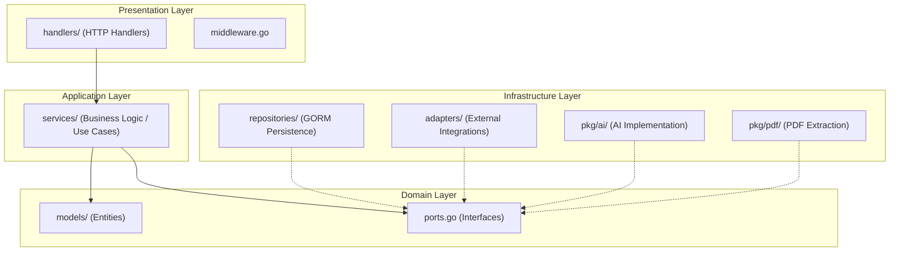

# Backend Architecture (Clean Architecture)

The backend is implemented in Go and follows **Clean Architecture** (Hexagonal Architecture) principles. This ensures that the core business logic is independent of frameworks, UI, and databases.

## Layer Mapping
- **Presentation Layer (`handlers/`)**: Responsible for handling HTTP requests, parsing parameters, and returning JSON responses.
- **Application Layer (`services/`)**: Contains the core logic and use cases of the application (e.g., analyzing a contract, managing auth).
- **Domain Layer (`models/`, `ports.go`)**: Defines the fundamental entities (User, Contract) and the interfaces (Ports) that the infrastructure must implement.
- **Infrastructure Layer**: Implements the technical details like database access (`repositories/`), email sending (`adapters/`), and AI service communication (`pkg/ai/`).
