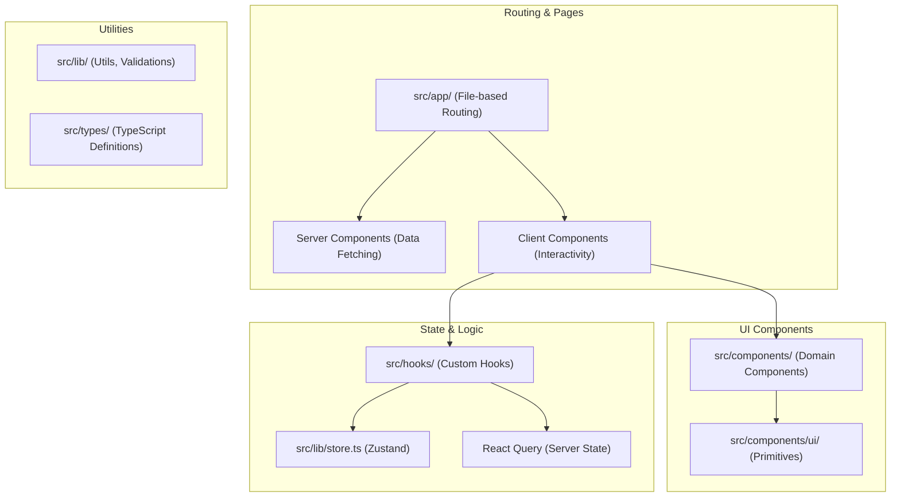

# Frontend Architecture

The frontend is a **Next.js 16** application utilizing the App Router and modern React 19 patterns.

## Architecture Details
- **Next.js App Router**: Optimized for performance with Server Components for initial data fetching and Client Components for rich interactivity.
- **Component Strategy**: Built on top of `shadcn/ui` (Radix UI + Tailwind CSS) for accessible and consistent UI primitives.
- **State Management**:
    - **Server State**: Managed by `@tanstack/react-query` for caching and synchronization with the Go API.
    - **Global Client State**: Managed by `Zustand` for lightweight, predictable client-side state.
- **Animations**: Orchestrated with `Framer Motion` for smooth transitions and interactive feedback.
